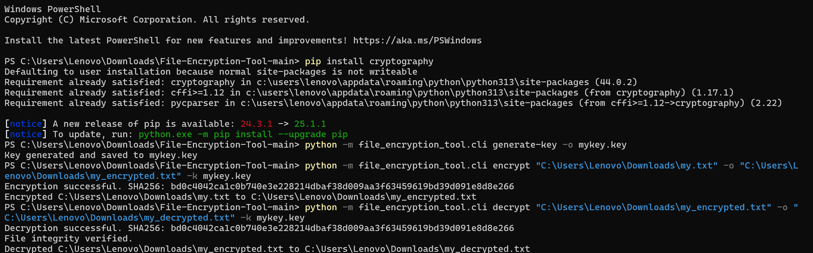

# 🔐 File Encryption Tool
**Your Digital Lockbox: Encrypt and Protect Files with Ease!**

  


---

## 🌟 Contributors

Thanks to these wonderful people for helping make File Encryption Tool better!

<a href="https://github.com/Dhruvi-tech/File-Encryption-Tool/graphs/contributors">
  
</a>

If you contributed and don’t see your avatar, please make at least one commit or open a pull request!

---

## 🌟 Project Overview

In a world where data security is paramount, **File Encryption Tool** helps you keep your sensitive files safe using **Fernet encryption** from the trusted `cryptography` library. This simple yet powerful Python tool ensures your data remains protected while offering a seamless user experience.

---

## ✨ Why This Tool?

- **🔒 Secure Files**: Encrypt your files using the industry-standard **Fernet encryption**.
- **🔑 Personal Keys**: Generate your own keys for a more secure encryption process.
- **💻 Cross-Platform**: Works smoothly across **Windows**, **macOS**, and **Linux**.
- **⚡ Lightning Fast**: Simple commands to encrypt and decrypt files in seconds.

---

## 🎬 How It Works:

### 1. Clone the Repository:
```bash
git clone https://github.com/Dhruvi-tech/File-Encryption-Tool.git
cd File-Encryption-Tool
```

### 2. Install Dependencies:
```bash
pip install cryptography
```

### 3. Generate an Encryption Key:
```bash
python -m file_encryption_tool.cli generate-key -o mykey.key
```

### 4. Encrypt Your File:
```bash
python -m file_encryption_tool.cli encrypt <file_path> -o <encrypted_file_path> -k mykey.key
```

### 5. Decrypt Your File:
```bash
python -m file_encryption_tool.cli decrypt <encrypted_file_path> -o <decrypted_file_path> -k mykey.key
```

---

### 🖼️ Screenshot: Example Usage



This screenshot demonstrates the full usage workflow:
- Repository clone  
- Dependency installation  
- Key generation  
- File encryption  
- File decryption

---

## 🛠️ Advanced Features
- **🔄 Custom Output Filenames**: Tailor your encrypted and decrypted filenames.
- **🔑 Secure Key Management**: Keep your encryption keys safe—if lost, the files are unrecoverable.
- **📂 Large File Support**: Encrypt files of any size efficiently.

---

## 🌍 Folder Structure
```bash
File-Encryption-Tool/
├── file_encryption_tool/
│   ├── __init__.py
│   ├── cli.py
│   └── utils.py
├── tests/
│   └── test_encryption.py
├── Preview.png
├── README.md
└── setup.py
```

---

## 👨‍💻 Tech Stack
- **Python 3.8+**: The backbone of this tool.
- **cryptography**: Secure your files with **Fernet encryption**.
- **pytest**: Test your tool for smooth functionality.

---

## ⚙️ Installation & Setup

1. Clone the repo and navigate into the project folder:
   ```bash
   git clone https://github.com/Dhruvi-tech/File-Encryption-Tool.git
   cd File-Encryption-Tool
   ```

2. Install the dependencies:
   ```bash
   pip install cryptography
   ```

3. Generate an encryption key:
   ```bash
   python -m file_encryption_tool.cli generate-key -o mykey.key
   ```

4. Encrypt your file:
   ```bash
   python -m file_encryption_tool.cli encrypt <file_path> -o <encrypted_file_path> -k mykey.key
   ```

5. Decrypt your file:
   ```bash
   python -m file_encryption_tool.cli decrypt <encrypted_file_path> -o <decrypted_file_path> -k mykey.key
   ```

---

## 🤝 Contributing

We welcome contributions! Fork the repo, create a branch, and submit a pull request. Ensure your code is well-tested and properly documented.

---

## 👏 Credits

- **Fernet**: Secure encryption from the `cryptography` library.
- **Python**: The programming language powering the tool.
- **MIT License**: Open-source license for usage and modification.

---

## 📄 License

MIT License. See [LICENSE](LICENSE) for details.

---

## 🔒 Protect Your Data!  
The **File Encryption Tool** is your go-to solution for encrypting sensitive files with ease and security. It’s fast, simple, and designed to provide top-notch protection for your files.
